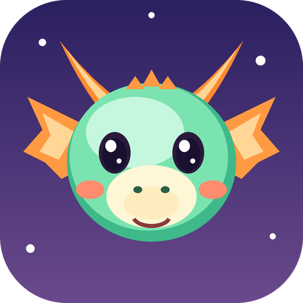
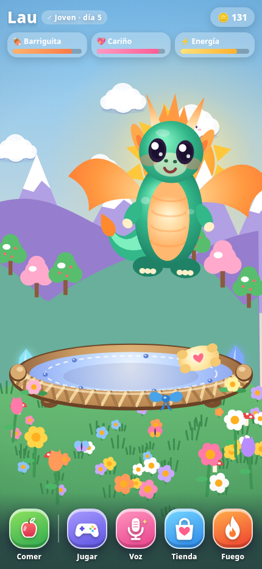
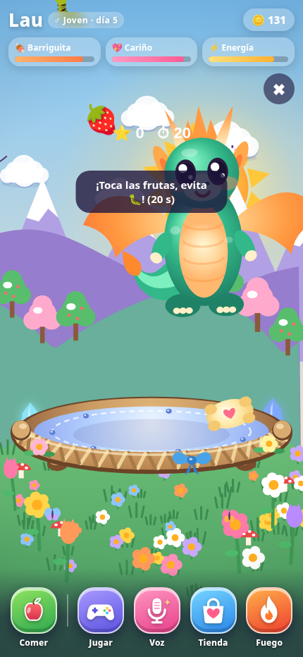
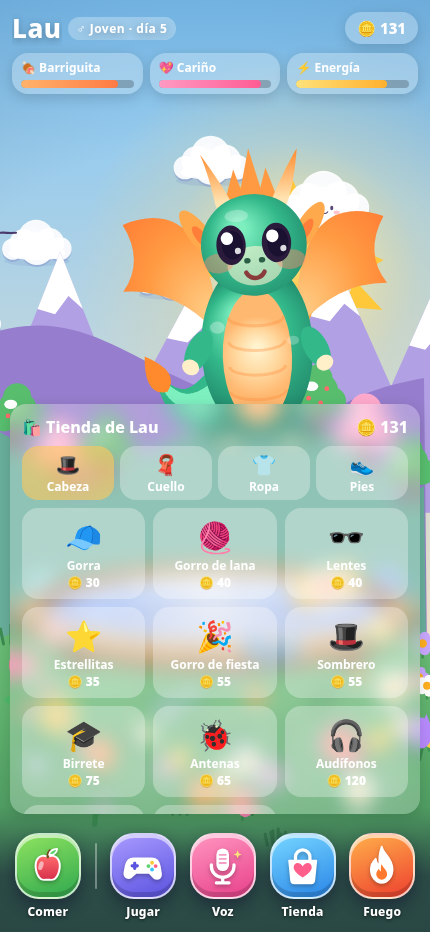

  

<h1 align="center">🐉 Lau</h1>

<b>Tu dragoncito virtual para Android.</b> Cuídalo, juega con él y míralo crecer.

  <b>Sin anuncios · sin cuentas · sin compras dentro de la app</b>

  <a href="../../releases/latest"><b>⬇️ Descargar para Android</b></a>
  ·
  <a href="https://YottoMtnz.github.io/lau/"><b>🌐 Página oficial</b></a>

---

## ¿Qué es Lau?

Lau es una mascota virtual en forma de dragoncito. Nace de un huevo, crece de **cría → joven → adulto**, necesita comida, cariño y energía, y va desbloqueando nuevas posibilidades con el paso de los días.

El juego principal funciona sin cuenta ni servidor. La conexión a internet solo es necesaria para funciones opcionales como consultar el clima real.

## ✨ Características

- 🍎 **Alimentación:** distintos alimentos con reservas que se recuperan con el tiempo.
- 💖 **Cariño:** puedes acariciar, tocar y mover a Lau directamente en pantalla.
- 🌱 **Crecimiento real:** huevo, cría, joven y adulto según tiempo y experiencia.
- 🎮 **7 minijuegos:** estrellas, frutas, globos, cesta de frutas, parejas, contar y memoria.
- 🪙 **Monedas y tienda:** gana tesoros y compra ropa y accesorios de cabeza, cuello, cuerpo y pies.
- 🎤 **Grabadora mágica:** habla y Lau responde con su voz de dragón y otras vocecitas.
- 🔥 **Fuego:** Lau puede escupir fuego; en dispositivos compatibles también responde al soplido del micrófono.
- 🌦️ **Clima opcional:** el cielo, la temperatura y el ambiente pueden seguir el clima y la hora reales usando una ubicación aproximada.
- 🎵 **Música ambiental:** pistas suaves según el momento y la situación.
- 🔔 **Avisos locales:** en Android puede avisarte cuando necesita atención o cuando llega el regalo diario.
- 💤 **Descanso:** la energía se recupera con sus periodos de sueño y siestas.

## 📸 Capturas

  
  
  

## 📱 Instalación en Android

1. Entra en **[Releases](../../releases/latest)** y descarga **`Lau.apk`**.
2. Abre el APK en tu teléfono.
3. Si Android lo solicita, permite temporalmente **instalar aplicaciones de esta fuente** para el navegador o gestor de archivos que estés usando.
4. Pulsa **Instalar**.

> Lau se distribuye como APK directo desde este repositorio. No necesita crear una cuenta para jugar.

## 🔒 Privacidad

- El progreso se guarda localmente en el dispositivo.
- El micrófono se usa únicamente al activar funciones que lo necesitan; la grabación no se sube a internet.
- La ubicación es opcional y se redondea antes de usarse para consultar el clima en Open-Meteo.
- Las notificaciones son locales y pueden desactivarse desde Android.
- No hay anuncios, analíticas, cuentas ni compras dentro de la app.

➡️ **[Leer la política de privacidad](docs/privacidad.html)**

## 🙏 Créditos

Música y sonidos: recursos de [OpenGameArt.org](https://opengameart.org) con licencias indicadas en **[CREDITOS.txt](CREDITOS.txt)**. Datos meteorológicos: [Open-Meteo](https://open-meteo.com).

## 📄 Derechos

© 2026 Fraudy Martinez Madruga (YottoMtnz). Todos los derechos reservados. Lau se distribuye gratis para uso personal; el código fuente del juego no se publica en este repositorio.

## 📬 Contacto

**laudragonvirtualgame2026@gmail.com**
